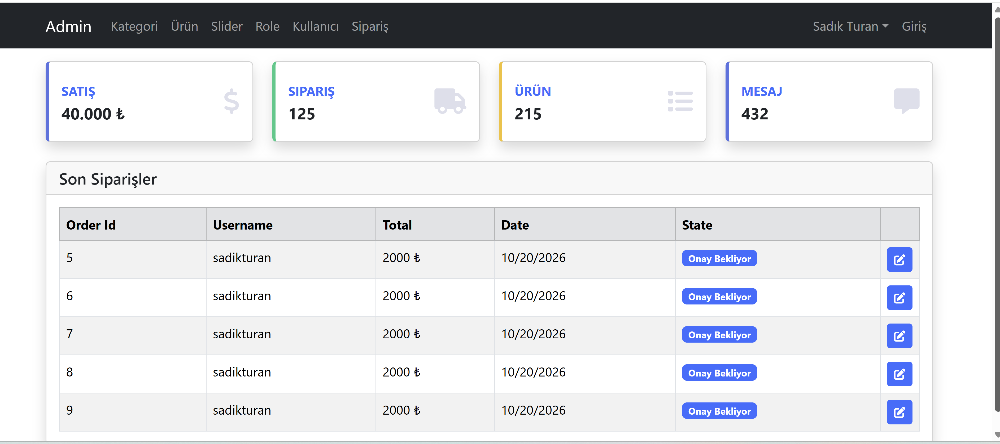

# 🖥️ Admin Panel

Kullanıcı yönetimi, veri takibi ve istatistiksel analiz gibi işlemleri merkezi bir arayüzden yönetmek amacıyla geliştirilmiş **modern**, **responsive** bir admin panel web uygulamasıdır.

<p align="left">
  <a href="https://img.shields.io/badge/status-active-success">  </a>
  <a href="https://img.shields.io/badge/license-MIT-informational">  </a>
  <a href="https://img.shields.io/badge/tech-HTML5%20%7C%20CSS3%20%7C%20JavaScript-blue">  </a>
</p>

---

## 📷 Önizleme

<p align="center">
  
</p>

---

## ✨ Özellikler

- Yönetici giriş / çıkış sistemi
- Kullanıcı ve içerik yönetimi panelleri
- Grafiklerle veri gösterimi (Chart.js veya benzeri)
- Dinamik tablo yapısı (CRUD işlemleri)
- Tamamen **responsive** ve mobil uyumlu tasarım

---

## 🛠️ Teknolojiler

- **HTML5**
- **CSS3**
- **JavaScript (Vanilla JS)**
- **Font Awesome**
- (Opsiyonel) **Chart.js** — grafik bileşenleri
- (Opsiyonel) **Bootstrap / CSS Grid** — arayüz düzeni

---

## ⚙️ Kurulum ve Çalıştırma

```bash
# Depoyu klonla
git clone https://github.com/HilalOnler/admin-panel.git

# Klasöre gir
cd admin-panel

# Tarayıcıda aç (sadece index.html'i açman yeterli)
# Windows
start index.html
# macOS
open index.html
# Linux
xdg-open index.html
```

---

## 🧭 Sayfa Yapısı

- **Login (login.html)** — Yönetici girişi
- **Dashboard (index.html)** — Genel görünüm, istatistik grafikler
- **Users (users.html)** — Kullanıcı listesi ve işlemler
- **Settings (settings.html)** — Panel ayarları

---

## 🌐 English (Short)

**Admin Panel** is a modern and responsive admin dashboard web app  
for managing users, content and data analytics with **HTML, CSS and JS**.

---

## 🤝 Katkı (Contributing)

Öneriler ve katkılar memnuniyetle karşılanır! Lütfen bir **issue** açın veya **pull request** gönderin.

---

## 📄 Lisans

Bu proje **MIT** lisansı ile lisanslanmıştır. Ayrıntılar için `LICENSE` dosyasına bakın.
